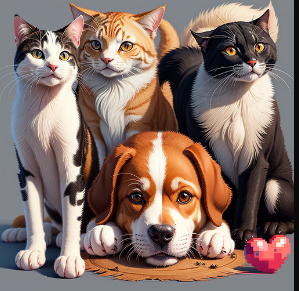

# *Saudações a todos👋🏼*



### <kbd>Sou Pedro Cézar e estou iniciando minha carreira como programador 🙇🏻</kbd>


### <kbd> Entre em contato ou veja meus trabalhos em:</kbd> 

---
## Contatos ✍🏼
[](https://criarmeulink.com.br/u/1689118555)[](https://wa.me/5521995897270?text=Bem-vindo%20ao%20clube%20dos%20bit%20confiantes!%20Aqui,%20programar%20%C3%A9%20uma%20quest%C3%A3o%20de%20bytes%20e%20n%C3%A3o%20de%20sorte.)[](emAndamento)[](https://www.linkedin.com/in/pedro-cézar-s-de-souza/)
___
## meu Stats✅


***
## *Minhas Línguas*  📖 

#### Aprendidas 🔛
<div style="display: inline-block"> 


</br></div>


#### Na lista 🔜
<div style="display: inline-block"> 


</br> </div>     

## Meus Desafios ⚙️

[](https://www.codechef.com/users/kzary) [](https://codepen.io/Ary-Pedro
) [](https://www.codewars.com/dashboard) 
[](https://www.frontendmentor.io/profile/Ary-Pedro) [](https://www.devchallenge.com.br/challenges?type=frontend)


``` 
Aos colegas programadores,Juntos, moldamos o futuro digital.
Superamos desafios com resiliência.
Continuemos aprendendo e crescendo.
Nossos códigos têm o poder de fazer a diferença.
Vamos inspirar uns aos outros e brilhar na programação.
```